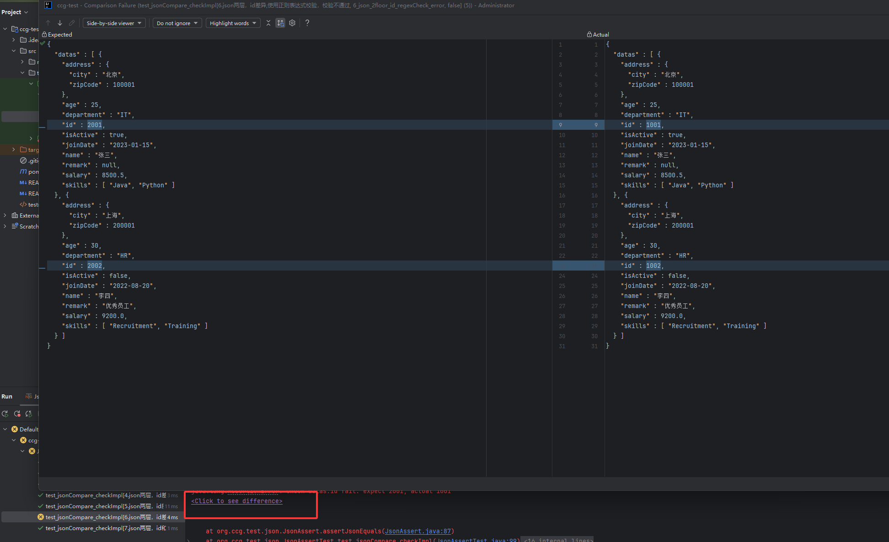

# JSON Validation Tool Library README
[中文](README.md)

## Introduction
If it helps you, please give me a star!

This is a powerful JSON validation tool library that provides flexible JSON comparison and custom validation functions.
In Java unit testing, this tool library can be easily used for JSON data validation, and when tests fail, detailed difference information will be displayed to help developers quickly locate problems.

## Core Functions

- **Basic Type Validation**: Supports comparison of basic data types such as strings, numbers, booleans, arrays, objects
- **Nested Structure Validation**: Supports deep comparison of multi-layer nested JSON structures
- **Custom Validators**: Provides extension interfaces supporting custom validation logic

## Main Features

### 1. Basic Validation
- **Numeric Comparison**: Supports integer and floating-point number comparison
- **String Comparison**: Strict string matching
- **Boolean Value Comparison**: True/false value validation
- **Array Validation**: Compare array elements and length in order
- **Object Validation**: Recursively compare object properties

### 2. Custom Validators
- **[IgnoreCheck.java](src/main/java/org/ccg/test/json/check/IgnoreCheck.java)**: Ignore specified field validation
- **[RegexCheck.java](src/main/java/org/ccg/test/json/check/RegexCheck.java)**: Regular expression validation
- **[TimeCheckNow.java](src/main/java/org/ccg/test/json/check/TimeCheckNow.java)**: Time field compared with current time
- **[TimeCheck.java](src/main/java/org/ccg/test/json/check/TimeCheck.java)**: Multi-format time validation
- **[ArrayNotOrderCheck.java](src/main/java/org/ccg/test/json/check/ArrayNotOrderCheck.java)**: Array unordered validation

### 3. Usage Examples
[JsonAssertTest.java](src/test/java/org/ccg/test/json/JsonAssertTest.java)

#### Basic Validation
```java
JsonAssert.assertJsonEquals(expectedJson, actualJson, "validation description");
```


#### With Custom Validator
```java
Check ignoreId = Check.ignore("datas.id");
JsonAssert.assertJsonEquals(expectedJson, actualJson, "validation description", ignoreId);
```


#### Time Validation
```java
Check timeNow = Check.timeNow("createTime");
JsonAssert.assertJsonEquals(expectedJson, actualJson, "validation description", timeNow);
```


#### Regular Expression Validation
```java
Check regexCheck = Check.regex("^\\d{4}$", "id");
JsonAssert.assertJsonEquals(expectedJson, actualJson, "validation description", regexCheck);
```


#### Array Unordered Validation
```java
Check arrayNotOrderCheck = Check.arrayNotOrder("datas");
JsonAssert.assertJsonEquals(expectedJson, actualJson, "validation description", arrayNotOrderCheck);
```


## Supported Data Types

- **String**: `string`
- **Number**: `integer`, `double`
- **Boolean**: `boolean`
- **Array**: `array`
- **Object**: `object`
- **Null**: `null`

## Error Handling

- **Detailed Error Information**: Provides clear difference comparison information
- **Path Location**: Shows the complete path of difference fields
- **Formatted Output**: Automatically formats JSON output for easy viewing
  

## Test Coverage

- **Single Layer Validation**: Basic data type comparison
- **Multi Layer Validation**: Nested structure comparison
- **Edge Cases**: null values, missing field handling
- **Custom Validation**: Various validator function testing

## Advantages

1. **Flexibility**: Supports custom validator extensions
2. **Accuracy**: Deep comparison, precise difference location
3. **Usability**: Concise API design
4. **Maintainability**: Clear architecture design

## Application Scenarios

- API response data validation
- JSON data consistency checking
- Data validation in unit testing
- Data migration validation

If you have any questions or new feature requirements, welcome to submit issues, or add my QQ for discussion: 549958058.
If you're willing, please donate me 10 yuan, if you have big company job recommendations, please contact me.
